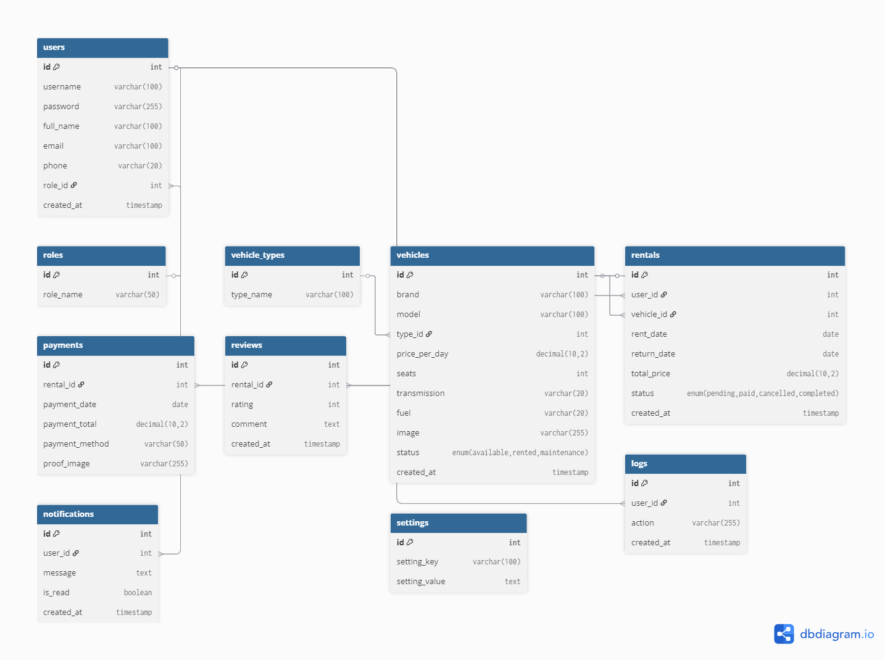

# 🚗✨ RentalKu - Your Trusted Vehicle Rental Partner ✨🚗

<div align="center">
  
  
  [](https://php.net)
  [](https://mysql.com)
  [](https://getbootstrap.com)
  [](https://sttbontang.ac.id)
  
  **💖 Sistem Manajemen Rental Kendaraan Modern & User-Friendly 💖**
  
  *Platform rental kendaraan terpercaya dengan tampilan yang cantik dan fungsionalitas lengkap*
</div>

---

## 🌸 **Meet the Developer** 🌸

<div align="center">
  <table>
    <tr>
      <td align="center">👩‍💻</td>
      <td><strong>Nama</strong></td>
      <td>Nurita Wahyuni</td>
    </tr>
    <tr>
      <td align="center">🎓</td>
      <td><strong>NIM</strong></td>
      <td>202312061</td>
    </tr>
    <tr>
      <td align="center">💌</td>
      <td><strong>Email</strong></td>
      <td>nuritawahyuni4@gmail.com</td>
    </tr>
    <tr>
      <td align="center">🏫</td>
      <td><strong>Program Studi</strong></td>
      <td>Teknik Informatika</td>
    </tr>
    <tr>
      <td align="center">🏛️</td>
      <td><strong>Institusi</strong></td>
      <td>Sekolah Tinggi Teknologi Bontang</td>
    </tr>
    <tr>
      <td align="center">📚</td>
      <td><strong>Proyek</strong></td>
      <td>Ujian Akhir Semester - Pemrograman Web</td>
    </tr>
  </table>
</div>

---

## 🌐 **Demo & Live Preview**

<div align="center">
  <table>
    <tr>
      <td align="center">
        <a href="#" target="_blank">
          <br/>
          <b>🎥 Video Demo</b><br/>
          <sub>YouTube Presentation</sub>
        </a>
      </td>
      <td align="center">
        <a href="#" target="_blank">
          <br/>
          <b>🌍 Live Demo</b><br/>
          <sub>Hosted Application</sub>
        </a>
      </td>
    </tr>
    <tr>
      <td align="center">
        <a href="#" target="_blank">
          
        </a>
      </td>
      <td align="center">
        <a href="#" target="_blank">
          
        </a>
      </td>
    </tr>
  </table>
</div>

> 📝 **Catatan:** Ganti link `#` di atas dengan URL YouTube dan hosting yang sebenarnya

### 🎬 **Video Demonstration**
- **YouTube Link:** https://youtu.be/GnM_Xjr9hTc 
- **Duration:** ~10-15 menit
- **Content:** Penjelasan fitur, demo penggunaan, dan code walkthrough

### 🌍 **Live Application**
- **Hosting URL:** https://nurita.mangaverse.my.id/
- **Test Accounts:** Gunakan akun demo yang tersedia
- **Status:** ✅ Online 24/7

---

## 📚 **Dokumentasi Lengkap**

Untuk informasi lebih detail tentang proyek ini, silakan kunjungi dokumentasi lengkap berikut:

<div align="center">
  <table>
    <tr>
      <td align="center">
        <a href="docs/DATABASE.md">
          <br/>
          <b>📊 Database</b><br/>
          <sub>Schema & Structure</sub>
        </a>
      </td>
      <td align="center">
        <a href="docs/INSTALLATION.md">
          <br/>
          <b>🔧 Installation</b><br/>
          <sub>Setup Guide</sub>
        </a>
      </td>
      <td align="center">
        <a href="docs/DEPLOYMENT.md">
          <br/>
          <b>🚀 Deployment</b><br/>
          <sub>Production Guide</sub>
        </a>
      </td>
      <td align="center">
        <a href="docs/USAGE.md">
          <br/>
          <b>📖 Usage</b><br/>
          <sub>User Manual</sub>
        </a>
      </td>
    </tr>
  </table>
</div>

### 📋 **Quick Navigation**
- [👩‍💻 Developer Info](#-meet-the-developer-) | [📖 Deskripsi](#-deskripsi-proyek) | [✨ Fitur](#-fitur-utama) | [🏗️ Arsitektur](#️-arsitektur-sistem)
- [📁 Struktur](#-struktur-direktori) | [🚀 Instalasi](#-instalasi-dan-setup) | [🖥️ Usage](#️-cara-penggunaan) | [🔒 Security](#-sistem-keamanan)
- [🎨 Design](#-design-system) | [🐛 Issues](#-known-issues--troubleshooting) | [📞 Support](#-support--contact) | [📄 License](#-license)

---

## 📖 **Deskripsi Proyek**

Sistem Rental Kendaraan (RentalKu) adalah aplikasi web modern yang dirancang untuk mengelola penyewaan kendaraan secara efisien. Aplikasi ini dikembangkan sebagai proyek akhir semester mata kuliah Pemrograman Web dengan implementasi teknologi web terkini dan best practices dalam pengembangan aplikasi berbasis web.

### 🎯 **Tujuan Aplikasi**
- Memudahkan pengelolaan bisnis rental kendaraan
- Menyediakan platform booking yang mudah untuk customer
- Mengotomatisasi proses transaksi dan laporan
- Memberikan pengalaman user yang modern dan responsif

## ✨ **Fitur Utama**

### 👑 **Panel Administrator**
- **📋 Dashboard Komprehensif** - Statistik real-time dan overview sistem
- **🚗 Manajemen Kendaraan** - CRUD lengkap untuk data kendaraan dengan gambar
- **👥 Manajemen Pengguna** - Kontrol akses dan data pengguna
- **📆 Manajemen Penyewaan** - Monitoring dan kontrol status rental
- **📜 Sistem Logging** - Tracking aktivitas dan audit trail
- **📈 Laporan & Analytics** - Insight bisnis dan performa rental
- **⚙️ Pengaturan Sistem** - Konfigurasi aplikasi dan business rules

### 👤 **Panel Customer**
- **🏠 Dashboard Personal** - Overview penyewaan dan statistik personal
- **🔍 Katalog Kendaraan** - Browse dan filter kendaraan tersedia
- **📝 Sistem Booking** - Proses reservasi yang mudah dan intuitif
- **📅 Riwayat Penyewaan** - Tracking semua transaksi rental
- **👤 Manajemen Profil** - Update informasi personal dan keamanan
- **⭐ Review & Rating** - Berikan ulasan untuk pengalaman rental

---

## 🏗️ **Arsitektur Sistem**

### **Tech Stack**
- **Backend**: PHP 8.0+ dengan PDO (Native)
- **Database**: MySQL 8.0+ / MariaDB 10.5+
- **Frontend**: Bootstrap 5.3, HTML5, CSS3, JavaScript
- **Authentication**: Session-based dengan password hashing
- **Icons**: Bootstrap Icons & Font Awesome
- **Security**: Prepared statements, input validation, XSS protection

### **Struktur Database**

<div align="center">
  
  <p><em>Entity Relationship Diagram - Sistem Rental Kendaraan</em></p>
</div>

```
📊 Database: rental_kendaraan
├── users (Data pengguna & admin)
├── roles (Role-based access control)
├── vehicle_types (Kategori kendaraan)
├── vehicles (Inventory kendaraan)
├── rentals (Transaksi rental)
├── payments (Data pembayaran)
├── reviews (Review & rating)
├── notifications (Sistem notifikasi)
├── logs (Audit trail)
└── settings (Konfigurasi sistem)
```

---

## 📁 **Struktur Direktori**

```
nurita/
├── 📁 admin/                      # Panel Administrator
│   ├── dashboard.php              # Dashboard admin
│   ├── index.php                  # Admin home
│   ├── users/                     # 👥 Manajemen pengguna
│   │   ├── index.php              # List users
│   │   ├── create.php             # Tambah user
│   │   ├── edit.php               # Edit user
│   │   ├── delete.php             # Hapus user
│   │   └── test_form.php          # Form testing
│   ├── vehicles/                  # 🚗 Manajemen kendaraan
│   │   ├── index.php              # List kendaraan
│   │   ├── create.php             # Tambah kendaraan
│   │   ├── edit.php               # Edit kendaraan
│   │   └── delete.php             # Hapus kendaraan
│   ├── vehicle_types/             # 🏷️ Manajemen tipe kendaraan
│   │   ├── index.php              # List tipe
│   │   ├── create.php             # Tambah tipe
│   │   ├── edit.php               # Edit tipe
│   │   └── delete.php             # Hapus tipe
│   ├── rentals/                   # 📆 Manajemen penyewaan
│   │   ├── index.php              # List rentals
│   │   ├── detail.php             # Detail rental
│   │   └── update_status.php      # Update status
│   ├── logs/                      # 📜 Log aktivitas
│   │   ├── index.php              # View logs
│   │   └── clear_logs.php         # Clear logs
│   └── settings/                  # ⚙️ Pengaturan sistem
│       └── index.php              # System settings
├── 📁 assets/                     # Asset statis
│   ├── css/                       # 🎨 Stylesheet
│   │   ├── admin-modern.css       # Admin styling
│   │   ├── style.css              # Main stylesheet
│   │   └── user-modern.css        # User styling
│   └── js/                        # ✨ JavaScript files
│       ├── admin-panel.js         # Admin scripts
│       ├── main.js                # Main scripts
│       ├── scripts.js             # Additional scripts
│       └── user-panel.js          # User scripts
├── 📁 docs/                       # 📚 Dokumentasi
│   ├── DATABASE.md                # Database documentation
│   ├── DEPLOYMENT.md              # Deployment guide
│   ├── INSTALLATION.md            # Installation guide
│   ├── USAGE.md                   # Usage guide
│   └── erd_diagram.png            # ERD image
├── 📁 includes/                   # 🔧 Core files
│   ├── auth.php                   # Authentication logic
│   ├── db.php                     # Database connection
│   ├── functions.php              # Helper functions
│   ├── header.php                 # Header template
│   ├── navbar.php                 # Navigation bar
│   └── footer.php                 # Footer template
├── 📁 sql/                        # 🗄️ Database schema
│   └── rental_kendaraan.sql       # Database dump
├── .htaccess                      # Apache configuration
├── .php-preview-router.php        # PHP preview router
├── index.php                      # 🏠 Landing page
├── login.php                      # 🔐 Login page
├── logout.php                     # 🚪 Logout handler
├── register.php                   # 📝 Registration page
├── dashboard.php                  # 📋 Main dashboard
├── user_dashboard.php             # 👤 User dashboard
├── vehicles.php                   # 🚗 Vehicle catalog
├── booking.php                    # 📝 Booking system
├── profile.php                    # 👤 Profile management
├── fix_admin.php                  # 🔧 Admin fix utility
└── README.md                      # 📄 Dokumentasi utama
```

---

## 🚀 **Instalasi dan Setup**

### **Persyaratan Sistem**
- **Web Server**: Apache 2.4+ atau Nginx 1.18+
- **PHP**: Version 8.0 atau lebih tinggi dengan extensions:
  - `php-pdo`, `php-pdo-mysql`, `php-session`
  - `php-json`, `php-mbstring`, `php-openssl`, `php-curl`
- **Database**: MySQL 8.0+ atau MariaDB 10.5+
- **Memory**: Minimum 512MB RAM
- **Storage**: Minimum 100MB disk space

### **Quick Start**

1. **Download Project**
   ```bash
   # Clone atau download project ke htdocs
   cd C:/xampp/htdocs/
   # Extract atau clone project
   ```

2. **Setup Database**
   ```sql
   CREATE DATABASE rental_kendaraan CHARACTER SET utf8mb4 COLLATE utf8mb4_unicode_ci;
   ```

3. **Import Schema**
   - Buka phpMyAdmin
   - Import file: `sql/rental_kendaraan.sql`

4. **Configure Database**
   ```php
   // Edit includes/db.php
   $host = 'localhost';
   $dbname = 'rental_kendaraan';
   $username = 'root';
   $password = '';  // XAMPP default
   ```

5. **Access Application**
   ```
   http://localhost/nurita/
   ```

### **Default Login Credentials**

#### **Administrator:**
```
Username: admin
Password: admin123
Access: Full system administration
```

#### **Demo User:**
```
Username: user
Password: user123
Name: John Doe
```

> ⚠️ **Penting:** Ubah password default setelah instalasi untuk keamanan!

---

## 🔒 **Sistem Keamanan**

### **Fitur Keamanan yang Diimplementasikan:**
- ✅ Session-based authentication
- ✅ Role-based access control (Admin/User)
- ✅ SQL injection prevention dengan prepared statements
- ✅ XSS protection dengan input sanitization
- ✅ Password hashing untuk keamanan data
- ✅ Input validation dan sanitization
- ✅ Audit trail dengan sistem logging

### **Saran Peningkatan Keamanan:**
- 🔄 Implementasi bcrypt untuk password hashing
- 🔄 CSRF protection untuk form submissions
- 🔄 HTTPS enforcement untuk production
- 🔄 Rate limiting untuk login attempts

---

## 🎨 **Design System**

### **Color Palette:**
- **Primary**: `#ff69b4` (Hot Pink)
- **Secondary**: `#ed92b8` (Soft Pink)  
- **Accent**: `#d63384` (Deep Pink)
- **Background**: `#fff0f5` (Lavender Blush)
- **Text**: `#333` (Dark Gray)

### **Typography:**
- **Font Family**: Bootstrap default dengan fallback system fonts
- **Responsive**: Mobile-first approach dengan Bootstrap 5.3
- **Icons**: Bootstrap Icons untuk konsistensi visual

---

## 🔄 **Changelog**

### **Version 1.0.0** (Current)
- ✨ Initial release dengan fitur lengkap
- ✨ Complete admin panel untuk manajemen sistem
- ✨ User dashboard dengan booking system
- ✨ Vehicle management dengan kategori
- ✨ Rental transaction management
- ✨ Review dan rating system
- ✨ Comprehensive logging system

### **Planned Updates:**
- 🚀 Email notification system
- 🚀 Payment gateway integration
- 🚀 Mobile app compatibility
- 🚀 Advanced reporting features
- 🚀 Multi-language support

---

## 🐛 **Known Issues & Troubleshooting**

### **Known Issues:**
- [ ] File upload untuk gambar kendaraan (dalam development)
- [ ] Email notification system (planned)
- [ ] Payment gateway integration (planned)

### **Common Issues:**
1. **Database Connection Error**
   - Pastikan MySQL service berjalan
   - Periksa kredensial database di `includes/db.php`

2. **Permission Denied**
   - Set permission folder ke 755
   - Pastikan web server memiliki akses baca/tulis

3. **Session Issues**
   - Pastikan `session_start()` dipanggil di setiap halaman
   - Periksa konfigurasi session di PHP

---

## 📞 **Support & Contact**

<div align="center">
  <table>
    <tr>
      <td align="center">
        <br/>
        <b>📧 Email</b><br/>
        <a href="mailto:nuritawahyuni4@gmail.com">nuritawahyuni4@gmail.com</a>
      </td>
      <td align="center">
        <br/>
        <b>🎥 YouTube</b><br/>
        <a href="https://youtu.be/GnM_Xjr9hTc" target="https://youtu.be/GnM_Xjr9hTc">Demo Video</a>
      </td>
      <td align="center">
        <br/>
        <b>🌐 Live Demo</b><br/>
        <a href="#" target="_blank">Try Application</a>
      </td>
      <td align="center">
        <br/>
        <b>🏫 Institution</b><br/>
        STT Bontang
      </td>
    </tr>
  </table>
</div>

### 📋 **Quick Links**
- **📧 Email Support:** nuritawahyuni4@gmail.com
- **🎬 Video Demo:** https://youtu.be/GnM_Xjr9hTc - Tonton penjelasan lengkap proyek
- **🌍 Live Application:** https://nurita.mangaverse.my.id/ - Coba aplikasi secara langsung  
- **📚 Documentation:** Baca dokumentasi lengkap di folder `docs/`
- **🏛️ Institution:** Sekolah Tinggi Teknologi Bontang

---

## 📄 **License**

Proyek ini dibuat untuk keperluan edukasi dalam rangka Ujian Akhir Semester mata kuliah Pemrograman Web di Sekolah Tinggi Teknologi Bontang.

```
Educational License
Copyright (c) 2025 Nurita Wahyuni - STT Bontang
Hanya untuk keperluan pembelajaran dan evaluasi akademik.
```

---

## 🙏 **Acknowledgments**

- **Dosen Pengampu**: Terima kasih atas bimbingan dalam mata kuliah Pemrograman Web
- **STITEK Bontang**: Institusi pendidikan yang memberikan kesempatan belajar
- **Bootstrap Team**: Untuk framework UI yang powerful
- **PHP Community**: Untuk dokumentasi dan resources yang lengkap
- **MySQL**: Untuk database management system yang reliable

---

## 📈 **Technical Specifications**

### **Minimum System Requirements:**
- **PHP**: >= 8.0
- **MySQL**: >= 8.0
- **Apache**: >= 2.4
- **RAM**: 512 MB
- **Storage**: 100 MB

### **Recommended:**
- **PHP**: 8.1+
- **MySQL**: 8.0+
- **RAM**: 1 GB+
- **SSD Storage**: 500 MB+

### **Browser Compatibility:**
- ✅ Chrome 90+
- ✅ Firefox 88+
- ✅ Safari 14+
- ✅ Edge 90+

---

<div align="center">
  
  
  <br/>
  
  
  
  
  
  <br/><br/>
  
  ### 🔗 **Quick Access**
  
  <a href="#" target="_blank">
    
  </a>
  <a href="#" target="_blank">
    
  </a>
  <a href="mailto:nuritawahyuni4@gmail.com">
    
  </a>
  
  <br/><br/>
  
  <p><strong>🌟 Nurita Wahyuni (202312061) - Teknik Informatika</strong></p>
  <p><em>📧 nuritawahyuni4@gmail.com | 🏫 Sekolah Tinggi Teknologi Bontang</em></p>
  <p><sub>📅 Terakhir diperbarui: 26 Juli 2025 | 🚀 Version 1.0.0</sub></p>
  
  <br/>
  <p><em>"Coding is not just about writing programs, it's about creating solutions that make life better."</em></p>
  <p><strong>© 2025 RentalKu - All Rights Reserved for Educational Purpose</strong></p>
</div>
